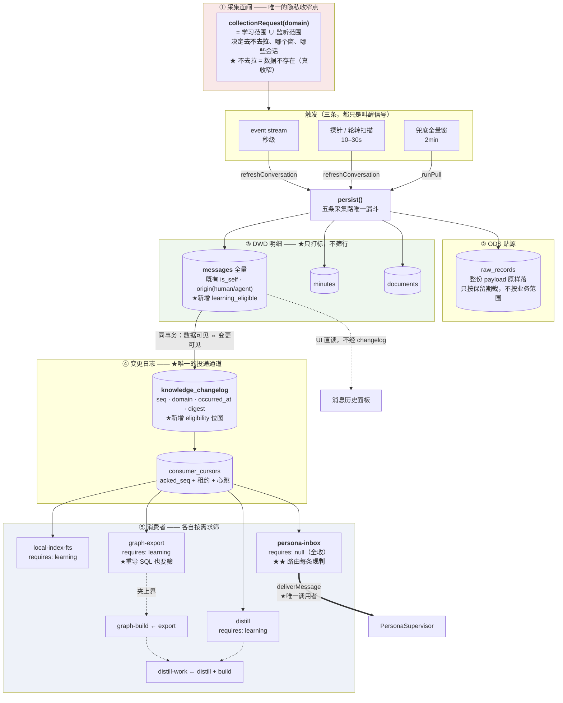

# 渠道数据平面 v4：ODPS 分层 · 单一投递路 · 只增不减的闭环

> **状态：已落地（A–D + Critical #1/#2）。** 本文是 v3 落地之后暴露出的**架构性**
> 问题的解法 —— 不是补缺口，而是把一处**分层错误**改对。
>
> **一句话**：`persist()` 那道闸装错了层 —— 它在 DWD 的写入侧按**一个下游**
> （学习侧）的口径筛掉行，于是**另一个下游**（分身）拿不到它需要的数据。
> ODPS 的惯例是「**明细层只打标，筛选在消费侧**」，这一版把它改回去。
>
> **前三版**：v1（消费者侧声明式）· v2（范围判据收成一份）·
> v3（生产者接线 + per-domain 范围 + 运行时视图）。
>
> ★ v4 与前三版的区别：前三版都在**补**（把声明与执行对齐），
> 这一版在**移**（把闸从写入侧移到消费侧）。所以它动的是分层，不是缺口。
>
> ★★ 落地后补修：放宽范围时 `applyScopeChange` 内 **bulk 重打标**
> （`retagLearningEligible`）；收窄时**不**自动 `rebuildGraph(true)`
> （知情可选，面板按钮），与 §3.2 B 对齐。

---

## 0. 三个决定（用户已拍，直接写进设计）

| #   | 决定                               | 对设计的影响                                                       |
| --- | ---------------------------------- | ------------------------------------------------------------------ |
| ①   | **取消快通道**，只要不影响最终效果 | 投递只剩 changelog 一条路 —— 判据不可能分叉（§4）                  |
| ②   | **不允许收窄学习范围**，交互上说明 | ★★★ **孤儿 fact 问题整个消失**（§3），purge 简化成只处理"手动重建" |
| ③   | 迁移按最适合的做                   | 加列（v30），`NULL` 语义显式（§5.3）                               |

★★★ **② 是这一版最大的简化**，而且用户的推理是对的：

> 「以前的都会累积着，只会更多对吧，除非手动重建？」

**是**。范围只增不减 ⇒ `learning_eligible` 只会 `0 → 1`，永不 `1 → 0` ⇒
图谱与画像里的东西**只增不减** ⇒ **不存在"该删而没删"的孤儿**。

而"手动重建"是唯一的清空入口，它已经存在（`rebuildGraph(fresh=true)` →
`wipeGraphData()`，`kl-server.service.ts:800,1850`），且它的语义正是
"删干净当前这个渠道的图，从当前范围重建"。

---

## 1. 这一版要修的三件事

### 1.1 分层错误：闸装在了 DWD 的写入侧

```
现在：
  渠道 → persist() ──[按学习范围丢弃]──→ messages → changelog → 全部消费者
                          ↑
                    ★ 一个下游的口径，替所有下游做了决定

应该：
  渠道 →[采集面闸]→ persist() ──[打标]──→ messages(全量) → changelog(带标)
                                                              ↓
                                      每个消费者按自己的口径取自己那一段
```

**后果**（三个，都在发生）：

| #   | 情形                               | 现象                                                                                         |
| --- | ---------------------------------- | -------------------------------------------------------------------------------------------- |
| ①   | 用户选了历史区间（`until` 在过去） | 新消息被上界挡住 → 不入库 → 分身**收不到**（`changed` 为空）                                 |
| ②   | 会话在监听范围、不在学习白名单     | 同上。而 `attentionScopeSave` 的并入只补 `conversationIds`、**不动 `since/until`**，救不了 ① |
| ③   | 分身**自己发的回复**               | 走 `refreshConversation` → 同一道闸 → 在 ①② 下同样进不来                                     |

★ ③ 有一个放大器：`admit()` 判"该不该回"要读**这个会话之前的往来**。
分身回过的话不在库里 → 下一轮它看不见自己说过什么 → 可能重复说、
或答得像没上下文。**而没有任何东西会报错。**

★★ 严重度：这三条只在"设了 `until`"或"白名单非空且监听会话不在其中"时触发。
默认路径（不限时间 / 不设白名单）不受影响 —— 所以它一直没暴露。

### 1.2 两条投递路：判据分叉的永久风险

`deliverMessage` 是两条路（快通道 / changelog）的唯一交汇点 ——
而它之所以存在，是因为 v2 修过一次真事故：**路由原来只挂快通道，
慢兜底整条绕过监听范围**。

也就是说：两条路的价值是几十毫秒，而它的代价是一个**永久的**
"判据会不会分叉"的维护负担。

★★★ 而 `runSharedConsumersOnce()` 就在 `runPull` 的**末尾、同一个调用栈里**
（`ingest.service.ts:2851`）—— 所谓"慢兜底"只慢那一栈剩下的工作。

### 1.3 `attention-stream` 在 `PRODUCERS` 里冒充生产者

判据很简单：**输入是我们自己的表 = 消费者**。

|      | chat-ingest            | attention-stream                     |
| ---- | ---------------------- | ------------------------------------ |
| 输入 | 渠道 CLI（外部）       | ★ `messages` / changelog（我们的表） |
| 输出 | `messages` + changelog | 一个判定 + 投递                      |

它**已经**是消费者形状（`persona-inbox` 就是它，有游标、有租约、有 `routed`）。
`PRODUCERS` 里那一行是**重复声明**，代价已经显形三处：

1. 自检判据① 必须 `filter(p => p.scope === "learning")` 才过 ——
   **一张声明表需要跳过某几行才能自检，就是分类错了**；
2. 它的 `scopeReady` 读的是**学习范围**（`buildProducerStatuses` 按
   `spec.domains` 查 map，而那个 map 喂的是 `readDomainScope`）——
   于是生产者卡上那一行显示的是另一件事；
3. 它的 `droppedOutOfScope` 恒 0，而它真的在跳过消息（数在
   `attention_coverage.skipped_count` 里）。

---

## 2. 全景图（v4 目标形状）



**四条不变式：**

1. **只有一个消息生产者**（chat-ingest）。三条触发路都汇进 `persist()`；
2. **DWD 不筛行**，只打标。筛选在消费侧（两个位置，见 §5.4）；
3. **只有一条投递路**（changelog）。`deliverMessage` 只有一个调用者；
4. **`learning_eligible` 只会 0→1**（范围只增不减）⇒ 图谱与画像只增不减。

---

## 3. ★★★ 「只增不减」把整块清理逻辑消掉了

用户的推理：

> 「我们不允许收窄学习范围，而且交互上说明收窄，这样不会是孤儿 fact 了呀，
> 以前的都会累积着，只会更多对吧，除非手动重建？」

**成立，而且它是这一版最大的简化。** 展开成不变式：

```
范围只增不减
   ⇒ learning_eligible 只会 0 → 1，永不 1 → 0
   ⇒ changelog 里那些 seq 的 eligibility 只会变宽
   ⇒ 图谱 / 画像 / FTS 里的内容只增不减
   ⇒ ★ 不存在"配置说没学过、产出说学过"这个矛盾
   ⇒ ★★ 不需要"从图里删掉某些 fact"这个能力
```

而这一条同时解释了**为什么增量建图够用**：kl 的 `extraction_cache` 按内容
hash 缓存、`checkpoint` 按步骤跳过、社群走增量 Leiden ——
输入只增的话，增量路径**永远**是对的，全量重烧只在"用户主动重建"时才需要。

### 3.1 唯一的清空入口：手动重建

它已经存在，语义也已经是对的：

```
用户点「重建图谱」
  → rebuildGraph(fresh=true)
  → wipeGraphData()      —— kl-server.service.ts:1850
     ★ 删掉整个 kl 目录（图 + 抽取缓存）
  → 从当前范围重新全量建
     ★ Phase A 会全量重跑向量化（实测 50 min，且**不可续传**）
```

★ 它的作用域正是用户说的「当前绑定已激活且授权渠道」—— 每渠道一个
`KlServerService` 实例、各自的 `dataDir`（`feedDirs.klRoot`），所以
重建只影响当前那个渠道的图。

★★ **不可续传**这一条必须在界面上说清（我的记忆里记着这个坑：
"建图卡住"多半是它在重烧全量 embedding，中途重启过就永远建不完）。

### 3.2 ★ 但有一个口子必须封（核实到的例外）

`mergeScopeOnlyGrowing` 现在**允许一种收窄** —— 它的注释自己写着
（`distill-source.service.ts:238`）：

> ★ 代价说清：`无 → 有` 这一格意味着"从不限收窄到具体列表"是**允许**的，
> 那是范围唯一能变窄的路径。

也就是这一格：

| before              | incoming    | 现在的结果  | 语义                         |
| ------------------- | ----------- | ----------- | ---------------------------- |
| `undefined`（不限） | `["A","B"]` | `["A","B"]` | ★ **从"全部会话"收窄到两个** |

这一格的**原始理由是对的**（要让飞书那种"有 since、没有 conversationIds"
的库能第一次设白名单，否则每次保存都被上一次的 `undefined` 吸收）。
但它与 ② 那个决定冲突 —— 而冲突的方向恰好是**会产生孤儿**：

```
T0  不限 → 图谱里有全部 92 个会话的知识
T1  用户收窄到 2 个会话（这一格允许）
    ⇒ learning_eligible 对另外 90 个会话变成 0     ← ★ 1 → 0 发生了
    ⇒ 图里那 90 个会话的 fact 成为孤儿
```

**封法**（三选一，我倾向 B）：

|       | 做法                                                                                                             | 代价                                                   |
| ----- | ---------------------------------------------------------------------------------------------------------------- | ------------------------------------------------------ |
| A     | 这一格也不许（返回 `undefined`）                                                                                 | 飞书永远设不了白名单 —— 那是超范围采集，**不可接受**   |
| **B** | 允许**首次**设白名单，但界面上明确告知「这会缩小学习范围，需要重建图谱才能让已学的知识跟着收窄」，并提供那个按钮 | 用户知情；孤儿存在但**可见、可清**                     |
| C     | 允许，且自动触发一次重建                                                                                         | 一次 50 min 且不可续传的操作被一次保存动作触发 —— 太重 |

★ B 的实质：**把"会产生孤儿"这件事从静默变成知情**。而它需要一处
真实的 UI 改动（保存前的确认 + 那个按钮的入口），不是一句文案。

### 3.3 purge 因此简化成什么

|                            | 现在                       | v4                                                                            |
| -------------------------- | -------------------------- | ----------------------------------------------------------------------------- |
| `purgeOutOfScopeMessages`  | 按学习范围删 `messages` 行 | ★ **只在"用户明确收窄"那一格跑**（§3.2 的 B），其余时候是 no-op               |
| `purgeOutOfScopeDocuments` | 同上（v3 加的）            | 同上                                                                          |
| 分身对话流的保留           | ——                         | ★ 不需要单独一条策略：`messages` 全量留，由 ODS 保留期 + `RetentionRunner` 兜 |

★★★ **这是 ② 带来的第二个简化**：我上一轮设计里那条"分身对话流要单独的
保留策略"（因为学习范围收窄会清掉分身的上下文）**整个不需要了** ——
范围不收窄，就没有"学习侧的清理拆掉分身上下文"这个冲突。

---

## 4. 单一投递路（取消快通道）

### 4.1 现在两条路各自是什么

```
快通道：persist() → emit("inbound.message") → deliverMessage → Mailbox.push → wake()
        条件：changed.length > 0 且 options.backfill !== true 且 订阅方已挂上

慢兜底：runPull 末尾 → runSharedConsumersOnce() → persona-inbox
                     ↑ ★ 同一个调用栈
        → deliverMessage（同一个函数）→ Mailbox.push（按 message_id 去重）→ wake()
```

★★★ 两条路**投同一批消息、走同一个函数、结果被同一个去重表吸收**。
快通道领先的是"从 `persist` 返回到 `runPull` 末尾"这一段 —— 那之间是
对账、回填一步、WAL checkpoint 判断。

### 4.2 取消它换来什么

|                  | 两条路                                                                               | 一条路                       |
| ---------------- | ------------------------------------------------------------------------------------ | ---------------------------- |
| 判据分叉风险     | ★ **永久存在**（v2 已发生过一次：路由只挂快通道）                                    | 结构上不可能                 |
| "为什么这条没投" | 三个原因三条路（unchanged / backfill / 路由）                                        | 一条路，一个 reason 枚举     |
| 崩溃时           | 快通道丢 → 必须有兜底 → 所以必然两条                                                 | changelog 是持久的，重放即可 |
| 延迟             | 几十毫秒领先                                                                         | 同栈末尾                     |
| 代码             | `inbound.message` 事件 + `createPersonaFastPath` + `personaFastPath` 字段 + 三处条件 | 删掉                         |

### 4.3 ★ 必须同时补的一件事（否则会退化）

`runSharedConsumersOnce()` 只在 `runPull` 末尾（`ingest.service.ts:2851`）。
而 `refreshConversation`（event stream / 探针触发那条）**落库后就返回了** ——
它靠下一轮 `tickPull`（2 分钟）里的 cycle 捞。

**所以取消快通道必须同时在 `refreshConversation` 末尾也驱动一次 cycle。**
不补的话 event stream 带来的秒级优势会退化成 2 分钟。

★ 这一条是**必须**的，不是可选优化。它也有一条门禁（§7）。

### 4.4 ★ 保留一个纯 `wake()`（不投递）

`emit("inbound.message")` 整个删掉之后，`PersonaService` 那个 8 秒
`TICK_MS` 定时器会成为唯一的取件触发（`persona.service.ts:152`）。
而消费者投递完会调 `onPersonaDelivered` → `wake()`，所以**这条已经有了**。

★★ 也就是说：不需要为"叫醒"保留 emit —— 消费者那条路本来就在叫醒。
`wake()` 的调用点从两处（快通道 + 消费者）变成一处（消费者），
而 `wake()` 本身有防抖（`wakeTimer`），所以行为不变。

### 4.5 那么秒级感知靠什么

```
event stream 收到事件（秒级）
  → refreshConversation(会话)          ← 定向补拉，只拉那一个会话
  → persist() 落库 + 同事务写 changelog
  → ★ 末尾驱动 runSharedConsumersOnce()  ← §4.3 要补的那一步
  → persona-inbox 消费者 → deliverMessage → Mailbox.push → wake()
  → PersonaService 被叫醒，开始起草
```

★ 全程仍在**同一个调用栈**里，与快通道的差别只是多了一次
`changesSince` 查询（走 `(domain, seq)` 索引）。

---

## 5. DDL 与迁移

### 5.1 现在的两张核心表（真实 DDL，`v3-outbox.ts:13`）

```sql
CREATE TABLE knowledge_changelog (
  seq         INTEGER PRIMARY KEY AUTOINCREMENT,  -- 游标就是它，全局单调
  op          TEXT NOT NULL,        -- 'upsert'|'delete'
  entity_type TEXT NOT NULL,        -- 'message'|'conversation'|'document'|'minutes'
  entity_id   TEXT NOT NULL,
  channel_id  TEXT NOT NULL,
  domain      TEXT NOT NULL,        -- 'chat'|'doc'|'minutes'|'contact'  ← 唯一分区维度
  occurred_at INTEGER NOT NULL,     -- 业务时间
  emitted_at  INTEGER NOT NULL,
  payload_ref TEXT,                 -- → raw_records.id
  digest      TEXT NOT NULL         -- 内容 hash
);
CREATE INDEX idx_changelog_domain ON knowledge_changelog(domain, seq);

CREATE TABLE consumer_cursors (
  consumer_id  TEXT PRIMARY KEY,
  acked_seq    INTEGER NOT NULL DEFAULT 0,   -- offset
  required     INTEGER NOT NULL DEFAULT 1,   -- 落后时阻不阻塞裁剪
  heartbeat_at INTEGER, stale_after_ms INTEGER NOT NULL DEFAULT 604800000,
  needs_full_rebuild INTEGER NOT NULL DEFAULT 0,
  lease_owner  TEXT, lease_expires_at INTEGER,   -- 租约 TTL 60s / 20s 续租
  last_error   TEXT, last_success_at INTEGER, updated_at INTEGER NOT NULL
);
```

### 5.2 v30 迁移（只加列，不动任何已发布迁移）

```sql
-- ★ 只加列 + 建索引。不改 v2/v3 的 SQL —— 改了 checksum 会让已迁移的 vault
--   启动即 DB_MIGRATION_FAILED（v18 那批真踩过）。

-- ① DWD 打标
ALTER TABLE messages ADD COLUMN learning_eligible INTEGER;   -- 可空，见 §5.3

-- ② changelog 的资格位图（bit 0 = learning）
ALTER TABLE knowledge_changelog ADD COLUMN eligibility INTEGER;  -- 可空

-- ③ 消费者按标签取那一段的索引
--   ★ 顺序是 (domain, eligibility, seq)：查询形状是
--     WHERE domain = ? AND (eligibility & 1) = 1 AND seq > ? ORDER BY seq
--   而 eligibility 是低基数（现在只有 2 个值），放中间让它成为等值前缀。
CREATE INDEX IF NOT EXISTS idx_changelog_domain_elig
  ON knowledge_changelog(domain, eligibility, seq);

-- ④ 学习侧语料查询的索引（graph-export / forge pull 都走它）
CREATE INDEX IF NOT EXISTS idx_messages_learning
  ON messages(channel_id, learning_eligible, sent_at);
```

★ **为什么不加 `attention_eligible`** —— 见 §6.2（它挡不住它声称要挡的东西）。

### 5.3 ★★★ `NULL` 的语义必须显式，而且两侧方向相反

三列都可空，`NULL` = **「这一行是打标之前入库的，我们不知道当时的资格」**。

不能给 `DEFAULT`：

| 给什么      | 后果                                                                               |
| ----------- | ---------------------------------------------------------------------------------- |
| `DEFAULT 1` | 把"已经被旧闸挡掉过的历史"说成当时合格 —— 而那些行压根不在库里，这个默认值没有意义 |
| `DEFAULT 0` | ★ 存量库的图谱与画像下一轮重导时**全部清空**                                       |

处置由消费者决定，而这必须是**一条显式判据**：

```ts
// ★ learning 侧：NULL 视为**合格**
//   判据：存量行能进库，就说明它当时通过了旧闸（那道闸比现在更严）。
//   视为不合格 = 存量库的图谱静默清空（功能消失）。
WHERE learning_eligible IS NOT 0

// ★★ 而不是 `= 1` —— 那会把 NULL 排除掉。这两个写法在 SQL 里
//   差一个字，而后果是"存量用户的图谱下一轮变空"。
```

★ 只有 learning 一侧需要这条判据（attention 那侧不加列，见 §6.2），
所以不存在 v3 那种"两个方向相反"的复杂度。

### 5.4 ★★★ 消费者筛选有**两个位置**，都不能省

这是最容易漏的一处，而它的形状与 v2 的 G1 一模一样
（"文档采集完全不看时间下界"）。

| 位置                      | 管什么                                | 落点                                              |
| ------------------------- | ------------------------------------- | ------------------------------------------------- |
| **A. changelog 标签过滤** | 要不要**唤醒**这个消费者 / 给它这一条 | `changesSince` + `ConsumerSpec.requires`          |
| **B. 重算时的 SQL WHERE** | 全量重导/重算时**取哪些行**           | `corpus-predicate.ts` + `graph-export` 的物化查询 |

★★★ **漏掉 B 的后果最具体**：`graph-export` 收到一个 seq（A 唤醒它），
然后**全量重导** `records.jsonl` —— 而那一趟**压根不看 changelog 的内容**，
它直接查 `messages`。于是 `learning_eligible = 0` 的行会被写进四件套。
**那是超范围，而且不报错。**

判据：**当一个消费者的输入是"表"而不是"changelog 的那一条"时，
A 对它无效。** 现在有两个这样的消费者：

| 消费者                        | 输入                                   | 需要 B 吗             |
| ----------------------------- | -------------------------------------- | --------------------- |
| `local-index-fts`             | changelog 那一条（逐条 upsert）        | 否                    |
| `graph-export`                | ★ **`messages` 全表**（重导四件套）    | ★ **是**              |
| `distill`                     | changelog 那一条（切窗入队）           | 否                    |
| `distill-work` → `forge pull` | ★ **`messages` 的时间片**              | ★ **是**              |
| `persona-inbox`               | changelog 那一条 + `messages.findById` | 否（它不筛 learning） |

★ B 的落点已经有一个共用点：`corpus-predicate.ts`（`graph-export` 与
`forge pull` 共用的语料谓词）。加 `learning_eligible IS NOT 0` **只需改那一处** ——
而那正是它当初被抽出来的理由（两侧对"空正文"的判据曾经不同）。

### 5.5 为什么 `occurred_at` 不能替代标签

诱人（它已经在表里、带索引）：

```sql
-- 看起来能省掉那一列：
WHERE seq > ? AND occurred_at >= :since AND occurred_at <= :until
```

三个问题：

1. **分区白名单表达不了** —— `occurred_at` 只有时间，没有"这条属于哪个会话/
   它在不在白名单里"。而白名单越界是那 46,415 条越界消息的主要成因；
2. **范围会变**（只增，但会变）—— 放宽 `since` 之后要重算，而"当时是什么"
   与"现在该给谁"是两件事。标签是后者的**物化**，查询时算 = 每次重算；
3. **`digest` 跳过与标签跳过会混在一起** —— 消费者报"跳过 N 条"时
   分不清是"内容没变"还是"不在范围内"，而两者的出路不同。

★ 结论：标签列是必须的，`occurred_at` 是它的补充（`distill` 已经在用它
把 seq 映射成时间窗）。

---

## 6. 生产者与消费者的耦合

用户要的是「**对生产者的耦合尽量少，对消费者的路由要求可以高点**」。
这一节是那句话的落地。

### 6.1 生产者只需要知道三件事

| 生产者要知道                    | 生产者**不**需要知道         |
| ------------------------------- | ---------------------------- |
| 去不去拉（`collectionRequest`） | 谁会消费这些数据             |
| 怎么落库（`persist*`，同事务）  | 学习范围与监听范围的**区别** |
| 打一个标（`learning_eligible`） | 分身要不要回这条消息         |

★★ `persist()` 那道 filter **消失** —— 它不再替任何下游做筛选决定。
生产者对"两个范围"的认识收缩成一件事：**并集是我的采集面**。

★ 而 `ProducerSpec.scope`（`"learning" | "attention"`）这个字段整个删掉：
摘掉 `attention-stream` 之后所有生产者都受 `collectionRequest` 管，
那个字段没有区分度了 —— 而它的存在正是自检需要 `filter` 特例的原因。

### 6.2 消费者：路由要求高（且**不**给 attention 加标签）

```ts
export interface ConsumerSpec {
  …
  /**
   * 只消费带这个标签的变更。`null` = 全收（自己判）。
   *
   * ★ learning 侧用它 —— 标签是**真闸**：范围只增不减，
   *   所以标签过期只会往"更严"漂（放宽了但标签还是 0），
   *   而那是安全的（下一轮重算补上）。
   *
   * ★★ persona 用 `null` —— 见下面那段 ★★★。
   */
  requires: "learning" | null
  /** 有没有路由闸（只有 persona 有） */
  routed: boolean
}
```

**★★★ 为什么 persona 是 `null`，不给它加 `attention_eligible`**

这是那个 `enabled_at` 问题问出来的：

|                | learning 标签                | attention 标签（如果加）                            |
| -------------- | ---------------------------- | --------------------------------------------------- |
| 范围能怎么变   | **只增不减**                 | ★ **可以关掉**（`active=0`）；`enabled_at` 只能变早 |
| 标签过期的方向 | 只往"更严"漂 → **安全**      | ★ **两个方向都漂**                                  |
| 漂错时的现象   | 放宽了但暂时没学（下一轮补） | ★ 「我关了它还在回消息」—— **用户看得见的错误行为** |
| 能当唯一判据吗 | ✅                           | ❌                                                  |

具体两个洞（如果加了标签并依赖它）：

```
T0  用户点「不再盯群 A」（active = 0）
    ⇒ 群 A 已入库消息的 attention_eligible 仍是 1（标签是落库那刻的快照）
    ⇒ 消费者按标签捞出来 → 若不再走路由，分身继续对它们起草   ← ★ 方向反了

T1  enabled_at 因某次操作变得更早（MIN 语义）
    ⇒ 那批旧消息**现在**满足第三条判据了，而标签还是 0
    ⇒ 分身看不到它们
```

**所以判据必须是 `AttentionRouter`（读 `attention_scope` 的当前值）、
每条现判。** 而 persona 收全部 chat seq 的成本可忽略 ——
路由（一次 `count(*)` 走部分索引 + 一次主键查）排在那三条带子查询的
准入 SQL **之前**（`inbox-consumer.ts:112` 的顺序理由），
范围外的消息在最便宜的那一步就走了。

★ 净效果：**少一列、少一处可能漂的副本、少一个"下一个人会以为它是闸"的字段**。

### 6.3 `attention-stream` 从 `PRODUCERS` 摘掉

判据：**输入是我们自己的表 = 消费者**（§1.3）。摘掉之后：

- 自检判据① 的 `filter(p => p.scope === "learning")` **可以删** ——
  那张表内部同质了；
- `ProducerSpec.scope` 整个删（§6.1）；
- 那个 `scopeReady` 读错表的 bug **自然消失**（v3 引入的）；
- `PRODUCERS` = "往 DWD 写的东西"，`CONSUMERS` = "从 changelog 读的东西"，
  **没有中间态**。

### 6.4 扩展性验收：加一个新东西要改几处

| 要加什么                                   | 改哪里                                                                                          | 处数 |
| ------------------------------------------ | ----------------------------------------------------------------------------------------------- | ---- |
| 新消费者（只要学习侧数据）                 | `CONSUMERS` 一行（含 `requires: "learning"`）+ handler + 注册                                   | 3    |
| 新消费者（要全量重算）                     | 同上 + ★ 自己的 SQL 加 `learning_eligible IS NOT 0`（§5.4 的 B）                                | 4    |
| 新数据域                                   | `DOMAINS` + `CHANGELOG_DOMAINS` + `DOMAIN_SCOPE_DEFAULTS` + `PRODUCERS` + 一个 `DomainProducer` | 5    |
| 新渠道                                     | 一个 `ChannelPlugin`（`capabilities.domains` 自述）                                             | 1    |
| 新的**范围维度**（如"只学某几个人说的话"） | `DistillScope` 一个字段 + `admitByScope` 的一道闸                                               | 2    |
| 消费者执行顺序                             | **不用改**（`resolveConsumerOrder` 算出来）                                                     | 0    |
| 新域的范围闸 / 覆盖面记账                  | **不用写**（`ProducerRunner` 覆盖）                                                             | 0    |
| ★ 让某个消费者看到"监听但不学"的数据       | **不用改**（`requires: null` 就收全部）                                                         | 0    |

★★ 最后一行是这一版的核心收益：**"哪个消费者能看到什么"从五处 SQL 里的
WHERE 变成一行声明**，而漏了那个 WHERE 的后果（图谱含越界数据）
由 §7 的门禁锁住。

---

## 7. 实施：四个阶段

> 按**风险递增**排。A/B/C 都不动表结构，D 才有迁移。
> 每个阶段独立可发、独立可回滚。

### 阶段 A — 学习范围真正只增不减（封 §3.2 那个口子）

| 改什么                                                                                                   | 落点                                            |
| -------------------------------------------------------------------------------------------------------- | ----------------------------------------------- |
| `mergeScopeOnlyGrowing` 的「不限 → 具体列表」那一格：**保留行为**，但返回一个"这是一次收窄"的信号        | `distill-source.service.ts:243` `widen`         |
| `save()` 拿到那个信号 → 日志 + 让 IPC 返回带一个 `narrowed: true`                                        | 同上                                            |
| 界面：保存前确认「这会缩小学习范围。已经学过的知识**不会**自动移除 —— 需要手动重建图谱」+ 那个按钮的入口 | `collection-scope-panel.tsx`                    |
| 门禁：那一格必须报 `narrowed`；其余五格不报                                                              | 新 `tests/unit/desktop/scope-narrowing.test.ts` |

★ **不改那一格的行为**（改了飞书永远设不了白名单 = 超范围采集）。
改的是"它从静默变成知情"。

★★ 这一阶段单独就有价值：现在收窄是**完全静默**的，用户不知道图里还留着。

### 阶段 B — 采集面改并集 + 补驱动

| 改什么                                                       | 落点                                          |
| ------------------------------------------------------------ | --------------------------------------------- |
| `collectionRequest(domain)` —— 新纯函数：学习范围 ∪ 监听范围 | 新 `packages/store/src/collection-request.ts` |
| `scopedConversationIds()` / `backfillSince()` 改成读它       | `ingest.service.ts:3004,2967`                 |
| `refreshConversation` 末尾驱动一次 cycle（§4.3）             | `ingest.service.ts`                           |
| 门禁：「监听范围里的会话，即使不在学习白名单，也必须被拉」   | 新用例                                        |
| 门禁：「`until` 在过去时，监听会话的新消息仍要被拉」         | 新用例                                        |

★★★ **这一阶段修掉 §1.1 那三个洞的主要部分**，且**不动表结构** ——
因为"拉回来了但学习范围不要"这批数据，在阶段 D 之前仍会被 `persist`
的闸丢掉。所以 A+B 之后：分身能收到消息（因为拉了），但那批消息
仍不入库（闸还在）。

★ 也就是说 **B 单独发不完整**。要么 B+D 一起发，要么 B 之后紧接 D。
我按 B → C → D 排是因为 C 与 D 无关（可以并行评审）。

### 阶段 C — 单一投递路 + 摘掉 attention-stream

| 改什么                                                                                 | 落点                                              |
| -------------------------------------------------------------------------------------- | ------------------------------------------------- |
| 删 `persist()` 末尾的 `emit("inbound.message")` 投递                                   | `ingest.service.ts:4006`                          |
| 删 `createPersonaFastPath` / `personaFastPath` 字段 / 那三处条件                       | `inbox-consumer.ts:180`、`ingest.service.ts:1067` |
| `attention-stream` 从 `PRODUCERS` 摘掉；删 `ProducerSpec.scope`；删自检判据① 的 filter | `topology.ts`                                     |
| 契约：`IngestSnapshot.producers` 少一行（4 → 3）                                       | `contract.ts`                                     |
| 门禁：`deliverMessage` **只有一个调用者**                                              | 源码断言                                          |
| 门禁：`refreshConversation` 必须驱动 cycle（B 那条的反证）                             | 已在 B                                            |

★ `Mailbox` 的 `message_id` 去重**留着** —— 消费者重放要幂等（租约抢占后
从 `acked_seq` 重放），那与快通道无关。

### 阶段 D — DWD 打标 + 消费者按标签取

| 改什么                                                               | 落点                                        |
| -------------------------------------------------------------------- | ------------------------------------------- |
| v30 迁移（§5.2 那四条 SQL）                                          | 新 `migrations/vault/v30-eligibility.ts`    |
| `persist()` 从"丢弃"改"打标 + 记数"                                  | `ingest.service.ts:3776`                    |
| `toChangelogEntry` 带上 `eligibility`                                | `normalizer.ts`                             |
| `ConsumerSpec.requires` + `changesSince` 加标签过滤                  | `topology.ts`、`changelog.ts:121`           |
| ★ `corpus-predicate.ts` 加 `learning_eligible IS NOT 0`（§5.4 的 B） | 那一处共用点                                |
| ★ `graph-export` 的物化查询同样                                      | `knowledge-feed/src/export-materializer.ts` |
| ★★★ `purge*` 的**判据换成采集面**（不是学习范围）—— 见下             | `purge-scope.ts` + 两个调用点               |
| 快照：**新增** `taggedIneligible` 计数（★ 不是改 dropped —— 见下）   | `producer-view.ts` + `producer.ts`          |
| ★★★ upsert 的 `WHERE` 要把"标签变宽"算作变化 —— 见下                 | `messages.ts`                               |

#### ★★★ 实施时改了设计表里的三处（每处都有理由）

**① `purge*` 不是"简化成只在收窄时跑"，而是"判据换成采集面"。**

原来的说法预设 purge 的判据不变、只是触发时机变少。核对之后那不够：
它拿**学习范围**当判据，而 DWD 只打标不筛行之后，库里**故意**留着
「只因监听而入库的」行 —— 它们本来就不在学习白名单里。于是每保存一次范围，
用户监听的那个群就被清空一次（连带 FTS / 向量 / 媒体文件），分身随即失去上下文。
**而它不报错。**

换成采集面之后语义才自洽：**"我们本就不该去拉的"才叫越界**。
类型上也拦住了（`PurgeCriterion` 要求 `attentionScoped`，`CollectionScope` 没有）。

**② 不把 `dropped` 改成"打标为 0 的条数"，而是**新增**一个计数。**

那两个数字的**出路不同**：

| 计数                | 事实                   | 用户的出路                                                         |
| ------------------- | ---------------------- | ------------------------------------------------------------------ |
| `droppedOutOfScope` | 压根没拉 / 没入库      | 改**采集面** —— 那是隐私边界                                       |
| `taggedIneligible`  | ★ **入库了、分身在用** | 改**学习范围** —— 放宽后 `retagLearningEligible`（~80 ms）立刻生效 |

合成一个的后果：一个**正常**状态会被界面报成"漏采了 300 条"（用户会去重采
一批就在库里的数据），而真的漏采（渠道没给时间 / 范围没就绪）会被这个正常值淹掉。

**③ upsert 的 `WHERE` 必须把"标签变宽"算作变化 —— 这是实施时才发现的。**

`upsertMany` 的 `WHERE` 原来只判**内容**。于是：

```
用户把一个群加进学习范围 → 那个群已在库里的消息内容没变
  ⇒ WHERE 为假 ⇒ 整个 UPDATE 不执行 ⇒ 标签永远停在 0
  ⇒ 学习侧永远看不到它们
```

表现是「我把这个群加进学习范围了，可它的历史消息一条都没学」，
而唯一的出路会变成"删库重采" —— 那正是 v4 要消灭的东西。

★ 同一处还有一个更隐蔽的：我第一版的合并规则写成
`MAX(COALESCE(旧,0), COALESCE(新,0))`，而它在「旧 = NULL、新 = NULL」这一格
得到 **0**（实测确认）—— 也就是存量库里**被编辑过的**消息会逐条掉出学习语料。
现在合并规则是显式三分支（`LEARNING_ELIGIBLE_MERGE`），且在 `SET` 与 `WHERE`
里共用同一份定义。

★★★ **这一阶段的风险集中在两处**：

1. **`NULL` 的处置**（§5.3）—— `IS NOT 0` 而不是 `= 1`。写错一个字
   存量库的图谱下一轮变空。要有一条专门的门禁；
2. **§5.4 的 B** —— 漏了它图谱会含越界数据，而且不报错。

---

## 8. 门禁与反证清单

> 反证 = 故意破坏一处，确认对应用例转红。v2 靠这个抓出过**四处**
> 作者自己写错的地方（含一条恒绿的测试与一处死代码），v3 抓出**三处**
> 推理错误。所以这不是形式。

| 阶段 | 破坏什么                                           | 期望                                               |
| ---- | -------------------------------------------------- | -------------------------------------------------- |
| A    | 「不限 → 具体列表」那一格不报 `narrowed`           | 收窄告知那条转红                                   |
| A    | 其余五格误报 `narrowed`                            | "只有那一格算收窄"那条转红                         |
| B    | `collectionRequest` 只返回学习范围（不并监听）     | 「监听会话必须被拉」转红                           |
| B    | 把 `until` 也应用到采集请求上                      | 「`until` 在过去时新消息仍要拉」转红               |
| B    | `refreshConversation` 末尾不驱动 cycle             | 「event stream 到投递必须同栈」转红                |
| C    | 留一处 `emit("inbound.message")` 的投递            | 「`deliverMessage` 只有一个调用者」转红            |
| C    | `attention-stream` 留在 `PRODUCERS`                | 自检判据①（去掉 filter 后）转红                    |
| D    | `NULL` 处置写成 `= 1`                              | ★「存量库的图谱不许变空」转红                      |
| D    | `corpus-predicate` 不加 `learning_eligible`        | ★「重导不许含越界数据」转红                        |
| D    | `graph-export` 的物化查询不加                      | 同上（两个消费者各一条）                           |
| D    | `persist` 仍然丢弃而不是打标                       | 「监听但不学的消息必须入库」转红                   |
| D    | changelog 不写 `eligibility`                       | 「消费者按标签取"到"的那一段」转红                 |
| D    | 给 persona 也加 `requires: "attention"`            | ★「分身不许有标签闸」转红（§6.2 那个洞）           |
| D    | ★ 上界豁免只给"只在监听范围里"的会话               | ★「既学也盯那一格同样豁免」转红（§10.2 第四条）    |
| D    | ★ 清理判据改回学习范围                             | ★「监听会话必须活下来」转红（真删数据）            |
| D    | ★ upsert 的 WHERE 只判内容（不判标签变宽）         | ★「标签 0→1 必须算变化」转红（放宽范围对历史无效） |
| D    | ★ 合并规则写成 `MAX(COALESCE(…,0), COALESCE(…,0))` | ★「存量 NULL 行不许被抹成 0」转红                  |

**★★★ 阶段 D 的门禁真的抓到了东西**：上表后四条里，**前三条是我自己写的
代码里的真 bug**（第一条在阶段 B 就写进去了、两轮评审没看出来），
第四条是我写这一版实现时的第一稿。也就是说这一节不是形式 ——
写反证用例的过程本身就是发现 bug 的过程。

#### 阶段 D 的实际门禁落点

| 文件                                              | 条数 | 锁什么                                       |
| ------------------------------------------------- | ---- | -------------------------------------------- |
| `tests/unit/store/eligibility-tagging.test.ts`    | 12   | 写侧：打标三态、只增不减、标签变宽算变化     |
| `tests/unit/ingest/eligibility-consumers.test.ts` | 8    | 读侧：谁按标签取、共用谓词、清理判据         |
| `tests/unit/desktop/corpus-parity.test.ts`        | +2   | ★ 行为级：`= 1` 会让存量库变空               |
| `tests/unit/desktop/ingest-scope-change.test.ts`  | +3   | ★ 监听会话不许被清、豁免上界、关掉后不再豁免 |
| `tests/unit/store/collection-request.test.ts`     | 改 3 | ★ 换方向：「既学也盯」那一格                 |

**提交前跑**（CLAUDE.md §3）：

```bash
pnpm run verify   # format + lint + typecheck + check:all + test + smoke
```

★★ `check:no-local-data` 在**有真实 vault 的机器上**跑过才算 ——
它在没有 vault 时跳过而非失败。

★ 阶段 D 之后建议跑一次 **CDP 探针**：A 阶段那个"收窄确认"是纯 UI，
而 v2 §12.2 的 G9（覆盖面整块不渲染）是单测抓不到、只有 CDP 抓到的那类。

---

## 9. 不做什么（以及为什么）

| 不做                       | 理由                                                                               |
| -------------------------- | ---------------------------------------------------------------------------------- |
| 加 `attention_eligible` 列 | §6.2 —— 它挡不住它声称要挡的东西（`enabled_at`/`active` 可变），而路由已经每条现判 |
| 分身对话流的单独保留策略   | §3.3 —— 范围不收窄就没有"学习侧清理拆掉分身上下文"这个冲突                         |
| 从图里删 fact 的能力       | §3 —— 只增不减 ⇒ 不存在孤儿。清空只在手动重建（已存在）                            |
| 改 `kl-graph/`             | 算法团队的仓库副本，改了会被同步覆盖                                               |
| 重写 `OutboxConsumer`      | 租约/重放/`required`/依赖闸，五条都是踩过坑才对的                                  |
| 合并三个 tick              | 调度天生不同（水位 / 每轮抽干 / 分档列举）；水位算错最贵                           |
| 合并三张覆盖面表           | 分区语义不同（会话 / 空间 / 无）                                                   |
| changelog 换真 MQ          | 单机桌面端，SQLite `seq` + 租约已够；多一个常驻进程 = 多一处故障面                 |
| 给覆盖面加百分比           | 分母在渠道 API 里不存在                                                            |
| 用 `occurred_at` 替代标签  | §5.5 三个理由                                                                      |

---

## 10. 哪些是核实过的、哪些不是

### 10.1 已核实（附位置）

| 事实                                                   | 位置                                                                                 |
| ------------------------------------------------------ | ------------------------------------------------------------------------------------ |
| `persist()` 是五条采集路径唯一漏斗                     | `ingest.service.ts:3721`                                                             |
| 规范表 + changelog 同事务                              | `outbox.ts:64,136`                                                                   |
| ★ `runSharedConsumersOnce()` 在 `runPull` 末尾**同栈** | `ingest.service.ts:2851`                                                             |
| 两条投递路共用 `deliverMessage`，它先读 `messages`     | `inbox-consumer.ts:103,184,196`                                                      |
| `changesSince` 只按 `domain` 过滤                      | `changelog.ts:121`                                                                   |
| `messages` 已有 `origin` / `is_self`                   | `v2-raw-normalized.ts:96-99`                                                         |
| 路由第三条判据用 `sentAt`（业务时间）                  | `attention-scope.ts:126,136`                                                         |
| `Mailbox.push` 按 `message_id` 去重                    | `mailbox.ts:199`                                                                     |
| ★ `mergeScopeOnlyGrowing` 允许「不限→列表」收窄        | `distill-source.service.ts:238`                                                      |
| 手动重建会 `wipeGraphData()`（删整个 kl 目录）         | `kl-server.service.ts:800,1850`                                                      |
| kl 有 `extraction_cache` / `checkpoint` / 增量 Leiden  | `ingest/extraction_cache.py`、`ingest/checkpoint.py`、`periodic/incremental_leiden/` |
| `load_all_messages` 只收目录（全量**读**）             | `loaders/message_loader.py:145`                                                      |
| 分身自己发的靠 `claimAgentOrigin` 对账入库             | `messages.ts:575`、`ingest.service.ts:3964`                                          |

### 10.2 ★ 我在这几轮里说错、后来核实纠正的三处

留在这里因为**它们说明了这份设计的可靠性边界**：

| 我说过                                     | 事实                                                     | 错因                                                   |
| ------------------------------------------ | -------------------------------------------------------- | ------------------------------------------------------ |
| 分身自己发的回复不进 `messages`            | 会进（`claimAgentOrigin` 对账）                          | 没查发送后的对账路径                                   |
| kl-graph 只能全量重导                      | 全量**读**、增量**算**                                   | 把 loader 签名当成整条流程                             |
| 快通道"几乎不触发"                         | 那条实测是**重扫历史**场景（`unchanged:51` 就是证据）    | 把特定场景当通用结论                                   |
| ★ 上界豁免只该给"**只**在监听范围里"的会话 | 要给**所有**在监听范围里的（含"既学也盯"，那是默认形态） | 把"要不要给学习侧"混进了"要不要拉"                     |
| ★ 两个新索引会被消费侧查询选中             | 规划器**都不选**（见 §10.3）                             | 拿"低基数等值前缀"的直觉当结论，没跑 EXPLAIN           |
| ★ 阶段 A 的收窄告知"已经给了出路"          | 只有一个「暂不重建」按钮 —— 出路**没接**                 | 门禁只查了文案里有没有"重建"这个词，没查有没有真的调用 |
| ★ 界面文案可以用 `**加粗**`                | `t()` 与 `hint` 都是纯文本 —— 星号**原样显示给用户**     | 顺着注释与设计文档的写法写文案（库里当时有 4 处）      |

★★★ 最后两条是**被"确认完整了吗"这一问逼出来的**，而它们都通过了
typecheck / lint / 4881 条单测 —— 因为它们在类型与行为上都正确。
两者共同的形状：**门禁检查了"提到了这件事"，而没检查"这件事真的发生了"。**
现在两处判据都改成了后者（真实调用 / 扫字符串内容），且都跑过反证。

★★ 共同点：**拿一处局部事实推了全局结论，而没读那个事实的上下文。**
所以 §10.1 那张表里每一条都带位置 —— 你可以逐条驳。

★★★ 第四条是**阶段 D 的门禁抓出来的**（我为 purge 写的那条"监听会话必须
活下来"用例转红）—— 而它在阶段 B 就已经写进代码了，两轮都没看出来。
那条判据的形状值得记住：**"只在 A 里"与"在 A 里"差一个字，
而后者才是默认形态。**

### 10.3 ★★★ 阶段 D 实测：三处推断被证伪

在**本机真库的副本**上跑了 v29 → v30（37,718 条消息 / 10,012 条 changelog，
库文件 1.25 GB；副本在 `/tmp`，按 CLAUDE.md §1.4）。

| 项                                 | 实测                                |
| ---------------------------------- | ----------------------------------- |
| v29 → v30 迁移耗时                 | **9–168 ms**                        |
| 迁移后 `learning_eligible` 分布    | ★ **37,718 行全为 `NULL`**          |
| 迁移后 `eligibility` 分布          | ★ **10,012 条全为 `NULL`**          |
| 一次全量打标 `UPDATE`（37,718 行） | **75–80 ms**                        |
| changelog 那条查询                 | 200 行 **≤1 ms**                    |
| graph-export 形状（按会话）        | **≤1 ms**，走 `idx_msg_conv_time`   |
| forge pull 形状（按时间窗）        | 400 行 **≤1 ms**，走 `idx_msg_sent` |

**★★★ 中间那两行是"`NULL` 的处置必须写对"的量化证据**：判据写成 `= 1` 的话，
这个库的学习侧下一轮拿到的是 **0 条** —— 不是"少一些"，是**全空**。
而它不报错。§8 那条门禁锁的正是这一格。

#### 被证伪的三处

| 我推断的                                      | 实测                                                                                                     |
| --------------------------------------------- | -------------------------------------------------------------------------------------------------------- |
| `(domain, eligibility, seq)` 会被那条查询选中 | ★ **不会** —— 走已有的 `idx_changelog_domain`。因为 `(x&1)!=0 OR x IS NULL` 不是等值约束，中间那列用不上 |
| `idx_messages_learning` 会服务两个语料消费者  | ★ **两条都不走它** —— 各自走 `idx_msg_conv_time` / `idx_msg_sent`（前导列已把行数收够）                  |
| 全量重打标可能是个成本问题（所以要小心触发）  | ★ **80 ms** —— 压根不是问题                                                                              |

★ 两个索引**保留**（很小，且删要再发一版迁移），但 v30 的注释已改成说实话：
**现在它们的作用是 0**，不许拿"有索引"当性能结论。

★★ 而第三条反过来支持了整个设计：范围放宽后重新打标是 80 ms 的事。
落地落点是 `retagLearningEligible`，挂在 `applyScopeChange` 里（purge 之后、
export/rebuild 之前）—— **不能**指望「下一轮渠道重采再 upsert」：
`onScopeChanged` 会立刻 export，那时标签还停在 0 ⇒ 静默缺语料。

### 10.4 ★★★ 真机日志暴露的三个 bug（v4 之外，但同一条链上）

用户跑起来之后贴了运行日志，逐条查下来有**三个真 bug** —— 都不是 v4
引入的，而是 v4 让这条链被仔细看了一遍才发现。

#### ① `11056` / `130003` 压根没分类 → 无限重试

```
WARN process non-zero exit … server_error_code: "11056"
WARN ingest refreshConversation failed {"detail":"渠道命令失败（exit 1）"}   ← 没落标记
```

不在 `SERVER_ERROR_CODES` 里的码落到兜底 `PROCESS_FAILED{retryable:true}`
→ 每 2 分钟重撞、永不落持久标记。**这与 `classifyDwsError` 注释里记着的
两次事故（`not_authenticated`、`ENTERPRISE_NOT_AUTHORIZED`）是同一个形状**，
也就是这个坑第三次发生了。

实测（真身份 + 真 `--profile`，12 个群逐个试）：

| code     | 个数 | 含义                                             |
| -------- | ---- | ------------------------------------------------ |
| `11056`  | 8    | `listBaseConversationByIds null`                 |
| `130003` | 2    | `OpendId is not in conversation`（本人不在群里） |
| `1001`   | 1    | 真的保密群                                       |
| 成功     | 1    | —                                                |

★ `11056` 同群连试 4 次全报、换时间窗一样、带不带 profile 一样 ⇒ 稳定拒绝
⇒ 归终态。★★ 而那 8 个群**在全局窗里一个都没有**（抽干 12 页 / 6 个会话 /
178 条）—— 所以归终态**不损失召回**，两条路本来都是 0 条。

#### ② `1001` 被复用于三件事 → 归因错误

```
WARN … "peerUid is required" … server_error_code: "1001"
WARN ingest conversation marked unreadable {"reason":"confidential"}   ← 错
```

上游把 `1001` 用于「真保密群」「`org not match`」「★ `peerUid is required`」
三件事，而代码把它一律记成 `confidential`。实测本机库 **56 个单聊/会话**
被标成"保密会话"，它们全都有对端 openId、格式正常、以前也读得到。

真因：那条命令要 `peerUid`（或 `--user <userId>`），而
`openDingTalkId → peerUid` 在服务端解析为空。我们**拿不到 userId** ——
反查要走花名册类命令，按 CLAUDE.md §5 不进白名单。

★ **结果**（跳过）是对的，**归因**是错的。而归因错的代价具体：用户读到
"对方设了保密"会去问对方，而问题在我们这边。

修法：`SERVER_CODE_VARIANTS` 按文案细分（`1001` 这个码本身没有区分度，
`reason` 也都是 `business_error` —— 文案是唯一判据）；每条分类**必须**给
`reason`（类型上必填），调用方优先用它。存量的 56 行由 v31 迁移**清掉结论
让它重判**（不可能知道当初各自是哪种，而清掉正好也能自愈）。

#### ③ ★★★ 「不可读」这个计数压根不存在（CLAUDE.md §5 只做了一半）

规则原话：「把它明确记成『不可读』而不是『0 条』。」

而实际状态：`unreadable_reason` 落库了、`cursors.ts` 的注释还写着
**"它该出现在「不可读」那个计数里"** —— 而那个计数**任何界面都读不到**。

于是 56 个读不了的会话，用户看到的只是"这些会话没消息"。
**数据缺失被表达成"本来就没有"**，正是这条规则要防的形状。

修法：`countUnreadable()` + 契约 `unreadablePartitions` + 覆盖面那一行文案。
★ 文档/听记域给 `null` 而不是 0 —— 那两个域没在统计这件事，
编一个 0 会被当成好消息（与听记 `pendingConversations` 恒 0 那次同一个教训）。

### 10.5 仍未实测的

- **§4.2 那个"几十毫秒"没有实测** —— 从 `persist` 返回到 `runPull` 末尾
  之间是对账 + 回填一步 + WAL checkpoint 判断。在回填那一轮上可能是**几秒**。
  ★ 要测一次这个间隔（一条日志即可），再决定要不要保留一个纯 `wake()` 的 emit；
- **阶段 A 的收窄确认取了"保存后留在页面上"**（不是保存前的阻塞确认）——
  判据：它需要用户做一个**决定**（要不要现在重建），而阻塞式对话框会把
  "保存范围"这个动作变重。★ 那一块现在有两个按钮（「现在重建图谱」
  → `graphBuild(fresh: true, channelId)`、「知道了，暂不重建」），
  门禁锁在**调用**上而不是文案上（`scope-narrowing.test.ts` 最后一条）。
  ★★ 措辞与"要不要显示预计耗时"仍未与产品对过；
- **打标那条路没有在真机上跑过一轮采集** —— 上面的实测是"迁移 + 查询计划"，
  不含"采一批新消息，看标签落对没有"。单测覆盖了那个逻辑（12 条），
  但真机上范围表与采集器的时序（v3 踩过的那个 1 秒差）没有重测。

---

## 11. 一句话总结

v1–v3 都在**补**（让声明与执行对齐）。v4 在**移**：把闸从 DWD 的写入侧
移到消费侧 —— 因为 DWD 是多个下游共用的，在写入时按一个下游的口径筛掉行，
其余下游就永久拿不到那些数据。

而用户的两个决定让这一版比原本简单得多：

- **取消快通道** ⇒ 投递只剩一条路，判据不可能分叉；
- **不允许收窄学习范围** ⇒ `learning_eligible` 只会 0→1 ⇒ 图谱只增不减
  ⇒ **孤儿 fact 不存在**，purge 与"分身对话流的单独保留策略"整块消掉。

剩下的复杂度集中在两处，都有专门的门禁：**`NULL` 的处置**（写错一个字
存量图谱变空）与**消费侧的两个筛选位置**（漏了 B 图谱会含越界数据）。
